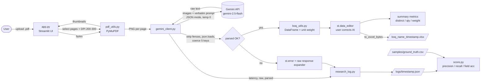
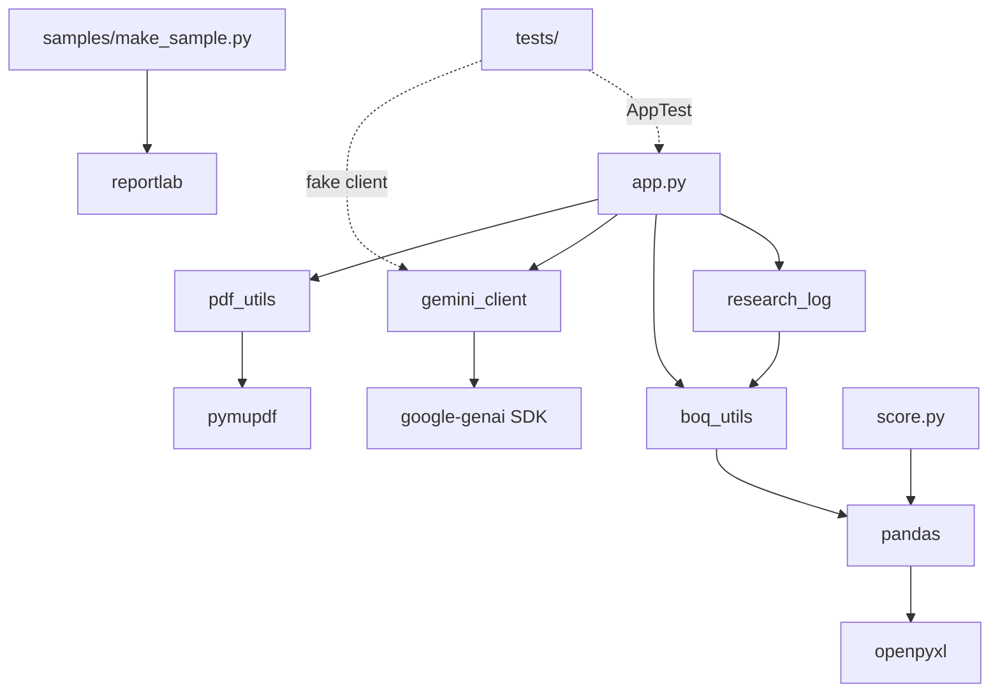
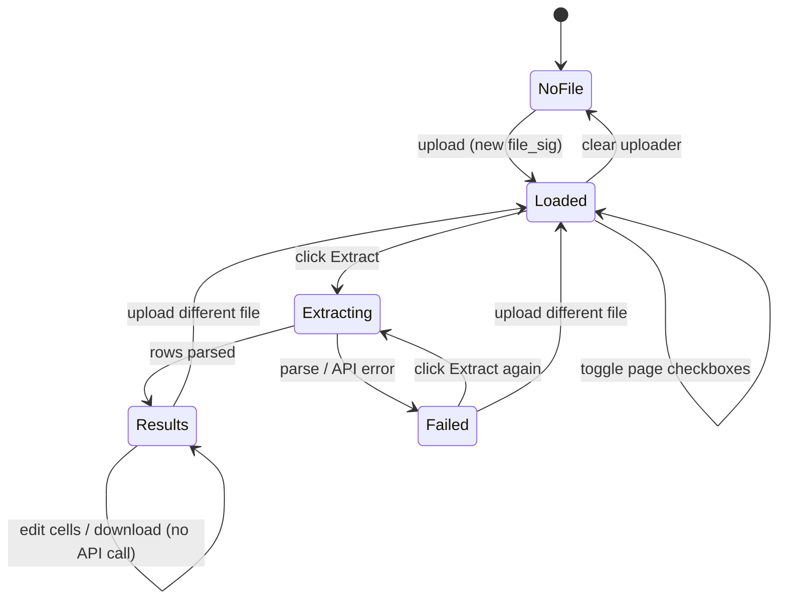

# Architecture (Mermaid)

## Data flow

```mermaid
flowchart LR
    U([User]) -->|upload .pdf| A[app.py<br/>Streamlit UI]
    A -->|bytes| P[pdf_utils.py<br/>PyMuPDF]
    P -->|thumbnails| A
    A -->|select pages + DPI 200-300| P
    P -->|PNG per page| G[gemini_client.py]
    G -->|images + verbatim prompt<br/>JSON mode, temp 0| GM[(Gemini API<br/>gemini-2.5-flash)]
    GM -->|raw text| G
    G -->|strip fences, json.loads,<br/>coerce 5 keys| R{parsed OK?}
    R -->|yes| B[boq_utils.py<br/>DataFrame + unit weight]
    R -->|no| E[st.error + raw response expander]
    B --> D[st.data_editor<br/>user corrects AI]
    D --> S[summary metrics<br/>distinct / qty / weight]
    D -->|to_excel_bytes| X[/boq_name_timestamp.xlsx/]
    G -->|latency, raw, parsed| L[research_log.py]
    E --> L
    L --> J[/logs/timestamp.json/]
    J --> SC[score.py<br/>precision / recall / field acc]
    T[/samples/ground_truth.csv/] --> SC
```

## Module dependencies

```mermaid
flowchart TD
    app[app.py] --> pdf_utils
    app --> gemini_client
    app --> boq_utils
    app --> research_log
    research_log --> boq_utils
    gemini_client --> genai[google-genai SDK]
    pdf_utils --> pymupdf
    boq_utils --> pandas --> openpyxl
    score[score.py] --> pandas
    make_sample[samples/make_sample.py] --> reportlab
    tests[tests/] -.fake client.-> gemini_client
    tests -.AppTest.-> app
```

## Session flow in app.py

```mermaid
stateDiagram-v2
    [*] --> NoFile
    NoFile --> Loaded: upload (new file_sig)
    Loaded --> Loaded: toggle page checkboxes
    Loaded --> Extracting: click Extract
    Extracting --> Results: rows parsed
    Extracting --> Failed: parse / API error
    Results --> Results: edit cells / download (no API call)
    Failed --> Extracting: click Extract again
    Results --> Loaded: upload different file
    Failed --> Loaded: upload different file
    Loaded --> NoFile: clear uploader
```
